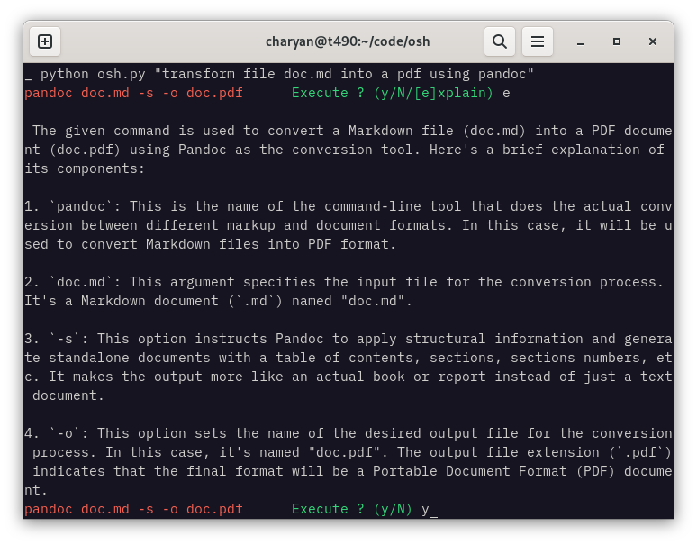

# Ollama Shell Helper (osh) : English to Unix-like Shell Commands translation using Local LLMs with Ollama



# How it works
The user request is passed to the ollama server along with system information from `uname -a` and the distribution (if running on Linux). The result is displayed in the terminal and asks for confirmation to execute the command.

```
usage: osh.py [-h] [-y] [-s] [PROMPT]

Get a command for a unix-like shell from a model running with Ollama and execute it

positional arguments:
  PROMPT

options:
  -h, --help         show this help message and exit
  -y, --yes          Execute the command without asking for confirmation
  -s, --system-info  Display system info
```

# Usage
## Ollama
Install [ollama](https://ollama.ai/)

Pull the model:
```
ollama pull mistral
```

Start the ollama server:
```
ollama serve
```

## OSH
```
python osh.py 'update all packages'

```